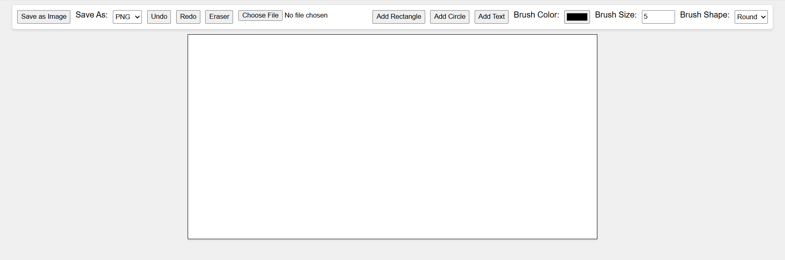

# 🎨 Advanced Web-Based Graphic Editor

A powerful and interactive web-based graphic editor built with **HTML, CSS, and JavaScript**.

This application allows users to:
- Draw freely
- Create shapes
- Insert text
- Edit artwork
- Export creations directly from the browser

---

## 📌 Overview

This project was created to provide a lightweight browser-based drawing and editing experience without installing desktop software.

### Users can:
- ✏️ Draw freely using customizable brushes
- 🔷 Insert shapes and text
- ↩️ Undo and redo actions
- 📂 Import existing images
- 💾 Export creations into different image formats

---

## ✨ Features

### 🖌️ Drawing Tools
- Freehand drawing
- Adjustable brush size
- Multiple brush shapes
- Custom brush colors

### 🔷 Shape Tools
- Add rectangles
- Add circles
- Add text elements

### 📂 File Management
- Upload images
- Save artwork
- Export to PNG

### ↩️ Editing Features
- Undo changes
- Redo actions
- Eraser tool

### 🎯 User Experience
- Clean and simple interface
- Real-time editing
- Browser-based (no installation)

---

## 📸 Screenshot

<p align="center">
  
</p>

---

## 🛠️ Technologies Used

| Technology | Purpose |
|------------|----------|
| HTML5 | Structure |
| CSS3 | Styling |
| JavaScript | Logic & Interactivity |
| Canvas API | Drawing Engine |

---

## 🚀 Installation

### Clone the repository

```bash
git clone https://github.com/fakhersayeb/graphic-editor.git
```

### Open the project

```bash
cd graphic-editor
```

### Run the application

Simply open:

```bash
index.html
```

in your browser.

---

## 📁 Project Structure

```plaintext
graphic-editor/
│
├── index.html
├── script.js
├── screenshots/
│   └── editor.PNG
└── README.md
```

---

## 🎮 How to Use

1. Open the editor
2. Choose brush settings
3. Draw on the canvas
4. Add shapes or text
5. Upload images if needed
6. Save your creation

---

## 🔮 Future Improvements

- [ ] Layers support
- [ ] Grid and snap-to-grid
- [ ] Zoom in / Zoom out
- [ ] Custom shape library
- [ ] Collaboration mode
- [ ] Keyboard shortcuts
- [ ] SVG export

---

## 🤝 Contributing

Contributions are welcome.

1. Fork the repository
2. Create a feature branch
3. Commit your changes
4. Open a Pull Request

---

## 👨‍💻 Author

**Fakher Sayeb**

- Software Engineer
- Web & Multimedia Developer

Portfolio:  
https://portfolio-seven-eosin-20.vercel.app

---

## ⭐ Support

If you like this project, give it a ⭐ on GitHub!